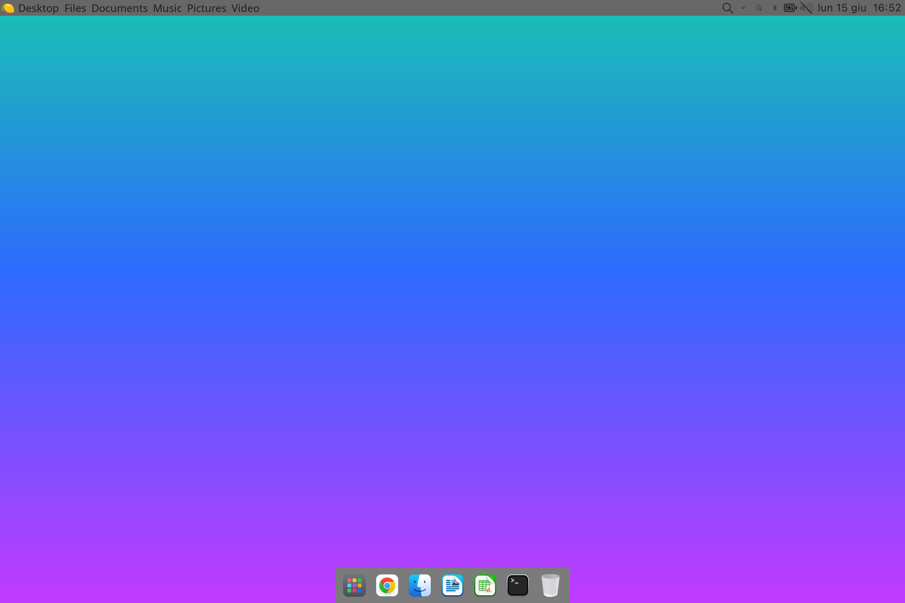

# macOS-XFCE (Dual-DE: XFCE & Cinnamon)

Trasforma un desktop **Linux Mint / Ubuntu con XFCE o Cinnamon** in stile **macOS Sonoma**:
tema WhiteSur, font SF Pro, menu bar con global menu + Spotlight (XFCE), dock Plank,
compositor con blur/angoli/ombre/animazioni (picom su XFCE), dialogo di spegnimento, hot
corners, Mission Control, gesture touchpad, notifiche, **login screen** (greeter
webkit) e **boot splash** (Plymouth).

> Testato su Linux Mint 22 (Ubuntu 24.04 noble) + XFCE 4.18 / Cinnamon + LightDM.
> Su altri desktop/display-manager alcune parti vanno adattate.

## Anteprima

Logo del menu (limone, al posto della mela):


### Anteprima Desktop



## Installazione

**✨ Installazione Rapida Automatica (Consigliata)**

Esegui questo singolo comando nel terminale per scaricare e installare tutto automaticamente:

```bash
bash <(curl -sL https://raw.githubusercontent.com/vannizanotto/macos-xfce/HEAD/setup.sh)
```

**Installazione Manuale**

Se preferisci clonare il repository manualmente:

```bash
git clone https://github.com/vannizanotto/macos-xfce.git ~/.macos-xfce
cd ~/.macos-xfce
./install.sh                 # base (senza login screen né boot splash)
```

### Esempi:

Di default l'installer **rileva da solo la scala dello schermo** (HiDPI) e imposta
**XFCE come sessione di login predefinita** — così un utente normale lo lancia e
basta rientrare, senza flag. Le opzioni servono solo per la messa a punto:

```bash
./install.sh                     # auto: rileva il DPI, imposta XFCE come sessione default
./install.sh --dpi 192           # forza una scala specifica (override dell'auto)
./install.sh --no-scale          # non toccare la scala
./install.sh --greeter --plymouth   # installa anche login screen e boot splash
./install.sh --no-sf-pro            # usa Inter invece di SF Pro
./install.sh --only picom,power     # reinstalla solo alcuni componenti
./install.sh --yes                  # non interattivo
```

**Importante**: lancia lo script **come utente normale**, NON con `sudo` (chiederà
lui la password dove serve: pacchetti, greeter, plymouth). Poi fai semplicemente
**logout/login**: XFCE è già la sessione predefinita, e pannello/scorciatoie/autostart
si applicano ad essa.

### Opzioni principali

| Opzione | Effetto |
|---|---|
| `--dpi N` | imposta la scala (`Xft.DPI`). Es. 144≈1.5×, 192≈2×, 240≈2.5×. Default: **rilevata automaticamente** dallo schermo. |
| `--no-scale` | non toccare la scala (disattiva l'auto-DPI). |
| `--greeter` | installa il login screen nody-greeter (serve il `.deb`, vedi sotto). |
| `--plymouth` | installa il boot splash limone (rigenera l'initramfs). |
| `--no-sf-pro` | non scaricare SF Pro, usa Inter. |
| `--no-animations` | picom senza animazioni (niente compilazione da sorgente). |
| `--no-whitesur` | non installare WhiteSur (lo dai per presente). |
| `--no-packages` | salta `apt install`. |
| `--only LISTA` | esegui solo i componenti elencati. |
| `--yes` | non interattivo. |

Componenti per `--only`: `packages,theme,sfpro,panel,dock,scaling,picom,power,corners,touchegg,notify,wallpaper,input,finder,emoji,dynwall,greeter,plymouth`.

I componenti `input`, `finder`, `emoji` e `dynwall` aggiungono, rispettivamente: scroll
naturale stile macOS, un Thunar in stile Finder con Quick Look (Spazio → gnome-sushi),
un selettore emoji (Super+Ctrl+Spazio, rofi+xdotool) e un wallpaper dinamico chiaro/scuro
(timer systemd utente). Il menu Apple usa una CSS chiara/frosted
(`~/.config/macos-xfce/apple-menu.css`) e l'orologio del pannello è un applet genmon che
apre `gsimplecal` al click.

## Login screen (nody-greeter)

Non è su apt: scarica il `.deb` per la tua Ubuntu dalle release del progetto e installalo,
poi lancia il componente greeter:

```bash
# https://github.com/JezerM/nody-greeter/releases
sudo apt install ./nody-greeter-*.deb
./install.sh --only greeter
```

Test senza logout: `nody-greeter --mode debug --theme macos` (in debug appare un popup
"Unable to determine socket to daemon": è normale).

## Cosa NON è incluso (e perché)

- **SF Pro** — è di Apple, non ridistribuibile. L'installer lo **scarica** dalla CDN Apple
  sul tuo PC (`--no-sf-pro` per usare Inter).
- **WhiteSur** (tema/icone/cursori) — clonati al volo da
  [vinceliuice](https://github.com/vinceliuice), poi patchati (angoli + batteria monocroma).
- **I set icone giganti** `WhiteSur` / `WhiteSur-dark` — l'installer di vinceliuice li gestisce.

## Note / adattamenti

- **HiDPI**: i pallini titlebar e i px del greeter non scalano col DPI → l'installer sceglie la
  variante xfwm4 (`-hdpi`/`-xhdpi`) in base a `--dpi`, ma il greeter è tarato per schermi ~2×.
- **Altezza pannello**: il margine anti-sovrapposizione (`xfwm4/margin_top`) è 52px. Se cambi
  l'altezza del pannello, aggiornalo.
- Il **blur** della menu bar si vede solo con un wallpaper colorato in alto (incluso un gradiente libero
  `gradient-light.jpg`; rigeneralo con `assets/wallpapers/gen_wallpaper.py`).
- Le animazioni richiedono `picom-anim` (fork FT-Labs) compilato da sorgente: l'installer chiede
  conferma; `--no-animations` per saltarlo.
- **Supporto Cinnamon**: l'installer usa uno strato di astrazione (`lib/de.sh`) per supportare
  nativamente sia XFCE sia Cinnamon.

## Disinstallazione

```bash
./uninstall.sh
```

Ripristina i default ragionevoli, rimuove autostart/script e i backup `*.macos-bak` di
pannello/scorciatoie. Temi, icone e font vanno rimossi a mano (istruzioni a fine script).

## Struttura

```
install.sh        orchestratore (una funzione per componente, idempotente)
uninstall.sh      ripristino
lib/common.sh     helper (log, sudo, backup, conferme)
assets/
  greeter/        tema del login (SF Pro scaricati a parte) + deploy script
  plymouth/       tema boot splash + generatore asset
  bin/            macos-power-dialog, macos-hot-corners
  picom/          picom.conf, picom-anim.conf
  gtk-3.0/        gtk.css (pannello scuro), settings.ini (mnemonics off)
  touchegg/       gesture
  themes/macOS/   temi notifiche + xfdashboard
  xfconf/         XML pannello + scorciatoie (layout della menu bar)
  panel-launchers/ launcher del pannello (Spotlight…)
  patches/        flatten-corners.py, battery-fix.sh
  icons/          lemon-logo.svg (logo del menu, Noto Emoji Apache-2.0)
  wallpapers/     gradient-light/dark.jpg + gen_wallpaper.py (sfondi liberi)
```

## Marchi e licenza

> **Non affiliato né approvato da Apple Inc.** Questo è un progetto di personalizzazione
> *macOS-style* per Linux. "macOS", "SF Pro" e i marchi Apple appartengono ad Apple Inc.

Per ridurre al minimo i problemi di copyright/marchio, il repo **non ridistribuisce asset Apple**:

- **Logo**: niente mela morsicata → icona **limone** colorata da
  [Noto Emoji](https://github.com/googlefonts/noto-emoji) (Apache-2.0), usata nel menu e nel boot splash.
  Vedi `docs/lemon-logo.png`.
- **Font SF Pro**: non incluso; l'installer lo **scarica** dalla CDN Apple sul tuo PC, oppure
  usa Inter (`--no-sf-pro`).
- **Wallpaper**: non sfondi macOS, ma **gradienti generati** (liberi).

Codice e config: **MIT**. Crediti: **Noto Emoji** © Google (**Apache-2.0**),
**WhiteSur** © vinceliuice (**GPL-3.0**, clonato a runtime).
