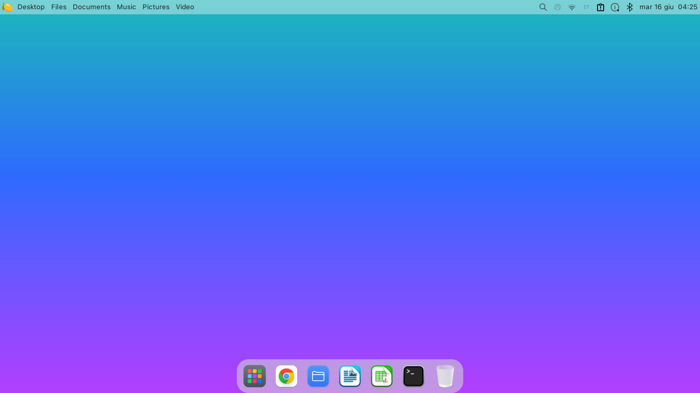

# macOS-XFCE (Dual-DE: XFCE & Cinnamon)

Trasforma un desktop **Linux Mint / Ubuntu con XFCE o Cinnamon** in stile **macOS Sonoma**:
tema WhiteSur, font SF Pro, menu bar con global menu + Spotlight (XFCE), dock Plank,
compositor con blur/angoli/ombre/animazioni (picom su XFCE), dialogo di spegnimento, hot
corners, Mission Control, gesture touchpad, notifiche, **login screen** (greeter
webkit) e **boot splash** (Plymouth).

> Testato su Linux Mint 22 (Ubuntu 24.04 noble) + XFCE 4.18 / Cinnamon + LightDM.
> Su altri desktop/display-manager alcune parti vanno adattate.

## Anteprima

Logo del menu (limone, al posto della mela):


### Anteprima Desktop



## Installazione

**✨ Installazione Rapida Automatica (Consigliata)**

Esegui questo singolo comando nel terminale per scaricare e installare tutto automaticamente:

```bash
bash <(curl -sL https://raw.githubusercontent.com/vannizanotto/macos-xfce/HEAD/setup.sh)
```

**Installazione Manuale**

Se preferisci clonare il repository manualmente:

```bash
git clone https://github.com/vannizanotto/macos-xfce.git ~/.macos-xfce
cd ~/.macos-xfce
./install.sh --de xfce       # CONSIGLIATO: look macOS completo (glass/blur/angoli)
```

> **👉 Consigliato: `--de xfce`.** Il look macOS *fedele* — vetro/blur, angoli
> arrotondati a tutti e 4 i lati, ombre morbide, menu globale dell'app nella barra in
> alto — gira solo in **XFCE** (con picom). È l'ambiente per cui il progetto è nato.
> Lanciato da un'altra sessione installa XFCE e lo imposta come login predefinito:
> basta fare logout e scegliere **Xfce**.

### Esempi:

Il default `auto` (senza flag) tematizza il desktop **in cui sei** e rileva la **scala**
(HiDPI) — comodo, ma su Cinnamon resta "piatto": niente glass/blur né angoli tondi in
basso (è un limite di Muffin, non del tema). Per la fedeltà piena usa `--de xfce`. Le
opzioni servono solo per la messa a punto:

```bash
./install.sh --de xfce           # CONSIGLIATO: ambiente XFCE pieno (glass/blur/angoli)
./install.sh                     # auto: tematizza il DE in uso + rileva il DPI
./install.sh --de cinnamon       # forza il path nativo Cinnamon (senza glass)
./install.sh --dpi 192           # forza una scala specifica (override dell'auto)
./install.sh --no-scale          # non toccare la scala
./install.sh --greeter --plymouth   # installa anche login screen e boot splash
./install.sh --no-sf-pro            # usa Inter invece di SF Pro
./install.sh --only picom,power     # reinstalla solo alcuni componenti
./install.sh --yes                  # non interattivo
```

**Importante**: lancia lo script **come utente normale**, NON con `sudo` (chiederà
lui la password dove serve: pacchetti, greeter, plymouth). Poi fai **logout/login**
per applicare pannello/scorciatoie/autostart. Con `--de xfce` lanciato da Cinnamon,
al rientro scegli (o trovi già impostata) la sessione **Xfce**.

### Opzioni principali

| Opzione | Effetto |
|---|---|
| `--dpi N` | imposta la scala (`Xft.DPI`). Es. 144≈1.5×, 192≈2×, 240≈2.5×. Default: **rilevata automaticamente** dallo schermo. |
| `--no-scale` | non toccare la scala (disattiva l'auto-DPI). |
| `--greeter` | installa il login screen nody-greeter (serve il `.deb`, vedi sotto). |
| `--plymouth` | installa il boot splash limone (rigenera l'initramfs). |
| `--no-sf-pro` | non scaricare SF Pro, usa Inter. |
| `--no-animations` | picom senza animazioni (niente compilazione da sorgente). |
| `--no-whitesur` | non installare WhiteSur (lo dai per presente). |
| `--no-packages` | salta `apt install`. |
| `--only LISTA` | esegui solo i componenti elencati. |
| `--yes` | non interattivo. |

Componenti per `--only`: `packages,theme,sfpro,panel,dock,scaling,picom,power,corners,touchegg,notify,wallpaper,input,finder,emoji,dynwall,greeter,plymouth`.

I componenti `input`, `finder`, `emoji` e `dynwall` aggiungono, rispettivamente: scroll
naturale stile macOS, un Thunar in stile Finder con Quick Look (Spazio → gnome-sushi, solo
XFCE), **Spotlight + selettore emoji** (rofi+xdotool) e l'**appearance dinamica** chiaro/scuro
(tema + wallpaper, timer systemd utente). Su XFCE il menu Apple usa una CSS chiara/frosted
(`~/.config/macos-xfce/apple-menu.css`) e l'orologio del pannello è un applet genmon che
apre `gsimplecal` al click. Per cosa cambia tra i due desktop, vedi la sezione sotto.

## XFCE o Cinnamon: cosa cambia

Con `--de auto` (default) viene tematizzato il desktop **in uso**. Le due strade danno
lo stesso look di base — WhiteSur, SF Pro, dock Plank, pulsanti finestra a sinistra,
scroll naturale, desktop pulito — ma differiscono qui:

| | **XFCE** (`--de xfce`) | **Cinnamon** (`--de cinnamon`) |
|---|---|---|
| Vetro / blur / ombre / angoli | ✅ via **picom** | ❌ Muffin non fa blur |
| Menu bar in alto | pannello XFCE + global menu app | pannello Cinnamon (Cinnamenu) |
| Spotlight | scorciatoia → rofi | `Super+Spazio` → rofi |
| Emoji picker | `Super+Ctrl+Spazio` | `Super+Ctrl+Spazio` |
| Tema chiaro/scuro | timer giorno/notte | `Super+Shift+D` + timer giorno/notte |
| Animazioni finestre | picom | effetti Cinnamon (`scale`, rapide) |
| Hot corners / Mission Control | xfdashboard | nativi Cinnamon (expo/scale) |

> Il **glass/blur** (vetro, ombre morbide, angoli arrotondati) è ottenibile **solo su
> XFCE** con picom: il compositor Muffin di Cinnamon non supporta il blur. È l'unica
> differenza estetica che non si può colmare su Cinnamon.

### Scorciatoie su Cinnamon

| Scorciatoia | Azione |
|---|---|
| `Super+Spazio` | Spotlight (lanciatore rofi) |
| `Super+Ctrl+Spazio` | Selettore emoji |
| `Super+Shift+D` | Inverti tema chiaro/scuro |

Vengono registrate via `org.cinnamon.desktop.keybindings`. Se non rispondono subito dopo
l'installazione, fai **logout/login** (la shell rilegge le scorciatoie all'avvio della
sessione).

### Appearance dinamica (chiaro di giorno, scuro di notte)

Il componente `dynwall` installa un timer systemd utente che ogni 30 min lancia
`macos-appearance.sh auto`: dalle **07 alle 19** tema + wallpaper chiari, altrimenti scuri.
Per cambiare a mano:

```bash
macos-appearance.sh light    # forza chiaro
macos-appearance.sh dark     # forza scuro
macos-appearance.sh toggle   # inverti (è ciò che fa Super+Shift+D)
```

Lo switch al tema scuro richiede la variante **`WhiteSur-Dark`**, installata da `c_theme`
(`-c Light -c Dark`); se manca, cambia solo il wallpaper e il tema resta chiaro.

## Login screen (nody-greeter)

Non è su apt: scarica il `.deb` per la tua Ubuntu dalle release del progetto e installalo,
poi lancia il componente greeter:

```bash
# https://github.com/JezerM/nody-greeter/releases
sudo apt install ./nody-greeter-*.deb
./install.sh --only greeter
```

Test senza logout: `nody-greeter --mode debug --theme macos` (in debug appare un popup
"Unable to determine socket to daemon": è normale).

## Cosa NON è incluso (e perché)

- **SF Pro** — è di Apple, non ridistribuibile. L'installer lo **scarica** dalla CDN Apple
  sul tuo PC (`--no-sf-pro` per usare Inter).
- **WhiteSur** (tema/icone/cursori) — clonati al volo da
  [vinceliuice](https://github.com/vinceliuice), poi patchati (angoli + batteria monocroma).
- **I set icone giganti** `WhiteSur` / `WhiteSur-dark` — l'installer di vinceliuice li gestisce.

## Note / adattamenti

- **HiDPI**: i pallini titlebar e i px del greeter non scalano col DPI → l'installer sceglie la
  variante xfwm4 (`-hdpi`/`-xhdpi`) in base a `--dpi`, ma il greeter è tarato per schermi ~2×.
- **Altezza pannello**: il margine anti-sovrapposizione (`xfwm4/margin_top`) è 52px. Se cambi
  l'altezza del pannello, aggiornalo.
- Il **blur** della menu bar si vede solo con un wallpaper colorato in alto (incluso un gradiente libero
  `gradient-light.jpg`; rigeneralo con `assets/wallpapers/gen_wallpaper.py`).
- **GPU richiesta per il blur**: il vetro smerigliato (e l'arrotondamento di tutti e 4 gli angoli delle
  finestre) richiede una GPU che regga il backend `glx` di picom. Su VM, render software (llvmpipe) o
  GPU datate (es. nouveau / NVAF) picom congela o divora la CPU, quindi l'installer **lo rileva da solo
  e ripiega sul compositing interno di xfwm4**: hai comunque la trasparenza di finestre/pannello e gli
  **angoli top arrotondati** nativi del tema, ma **niente blur**. Il vetro pieno serve una macchina con
  accelerazione GPU funzionante (Intel/AMD/NVIDIA recente).
- Le animazioni richiedono `picom-anim` (fork FT-Labs) compilato da sorgente: l'installer chiede
  conferma; `--no-animations` per saltarlo.
- **Supporto Cinnamon**: l'installer usa uno strato di astrazione (`lib/de.sh`) per supportare
  nativamente sia XFCE sia Cinnamon.

## Disinstallazione

```bash
./uninstall.sh
```

Ripristina i default ragionevoli, rimuove autostart/script e i backup `*.macos-bak` di
pannello/scorciatoie. Temi, icone e font vanno rimossi a mano (istruzioni a fine script).

## Struttura

```
install.sh        orchestratore (una funzione per componente, idempotente)
uninstall.sh      ripristino (XFCE via xfconf, Cinnamon via gsettings)
lib/common.sh     helper (log, sudo, backup, conferme)
lib/de.sh         astrazione desktop: XFCE (xfconf) vs Cinnamon (gsettings/dconf)
assets/
  greeter/        tema del login (SF Pro scaricati a parte) + deploy script
  plymouth/       tema boot splash + generatore asset
  bin/            macos-power-dialog, macos-hot-corners, macos-spotlight.sh,
                  macos-appearance.sh (chiaro/scuro), macos-emoji.sh, …
  cinnamon/       applet Cinnamenu@json + panel-layout.dconf (menu bar Cinnamon)
  systemd/        timer/service utente per l'appearance dinamica
  picom/          picom.conf, picom-anim.conf (solo XFCE)
  gtk-3.0/        gtk.css (pannello scuro), settings.ini (mnemonics off)
  touchegg/       gesture
  themes/macOS/   temi notifiche + xfdashboard
  xfconf/         XML pannello + scorciatoie XFCE (layout della menu bar)
  panel-launchers/ launcher del pannello (Spotlight…)
  patches/        flatten-corners.py, battery-fix.sh
  icons/          lemon-logo.svg (logo del menu, Noto Emoji Apache-2.0)
  wallpapers/     gradient-light/dark.jpg + gen_wallpaper.py (sfondi liberi)
```

## Marchi e licenza

> **Non affiliato né approvato da Apple Inc.** Questo è un progetto di personalizzazione
> *macOS-style* per Linux. "macOS", "SF Pro" e i marchi Apple appartengono ad Apple Inc.

Per ridurre al minimo i problemi di copyright/marchio, il repo **non ridistribuisce asset Apple**:

- **Logo**: niente mela morsicata → icona **limone** colorata da
  [Noto Emoji](https://github.com/googlefonts/noto-emoji) (Apache-2.0), usata nel menu e nel boot splash.
  Vedi `docs/lemon-logo.png`.
- **Font SF Pro**: non incluso; l'installer lo **scarica** dalla CDN Apple sul tuo PC, oppure
  usa Inter (`--no-sf-pro`).
- **Wallpaper**: non sfondi macOS, ma **gradienti generati** (liberi).

Codice e config: **MIT**. Crediti: **Noto Emoji** © Google (**Apache-2.0**),
**WhiteSur** © vinceliuice (**GPL-3.0**, clonato a runtime).
