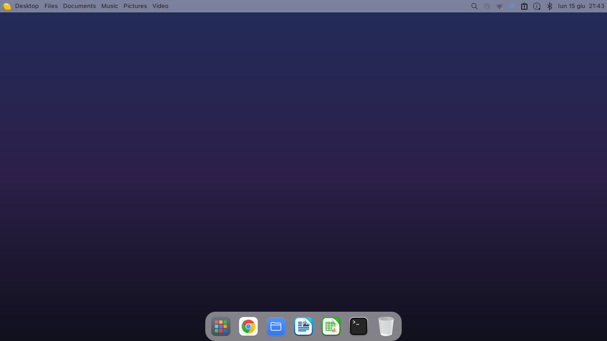

# macOS-XFCE (Dual-DE: XFCE & Cinnamon)

Transforms a **Linux Mint / Ubuntu desktop with XFCE or Cinnamon** into a **macOS Sonoma** style:
WhiteSur theme, SF Pro font, menu bar with global menu + Spotlight (XFCE), Plank dock,
compositor with blur/corners/shadows/animations (picom on XFCE), power dialog, hot
corners, Mission Control, touchpad gestures, notifications, **login screen** (webkit greeter)
and **boot splash** (Plymouth).

> Tested on Linux Mint 22 (Ubuntu 24.04 noble) + XFCE 4.18 / Cinnamon + LightDM.
> On other desktops/display managers some parts may need adaptation.

## Preview

Menu logo (lemon, instead of the apple):


### Desktop Preview



## Installation

**✨ Quick Automatic Install (Recommended)**

Run this single command in your terminal to automatically download and install everything:

```bash
bash <(curl -sL https://raw.githubusercontent.com/vannizanotto/macos-xfce/HEAD/setup.sh)
```

**Manual Installation**

If you prefer to clone the repository manually:

```bash
git clone https://github.com/vannizanotto/macos-xfce.git ~/.macos-xfce
cd ~/.macos-xfce
./install.sh                 # base (no login screen or boot splash)
```

### Examples:

By default the installer **auto-detects your screen scaling** (HiDPI) and sets
**XFCE as the default login session** — so a normal user just runs it and logs
back in, no flags needed. Options are only for fine-tuning:

```bash
./install.sh                     # auto: detects DPI, sets XFCE as default session
./install.sh --dpi 192           # force a specific scaling (override auto)
./install.sh --no-scale          # don't touch scaling at all
./install.sh --greeter --plymouth   # also install login screen and boot splash
./install.sh --no-sf-pro            # use Inter instead of SF Pro
./install.sh --only picom,power     # reinstall only specific components
./install.sh --yes                  # non-interactive
```

**Important**: run the script **as a normal user**, NOT with `sudo` (it will ask for
the password where needed: packages, greeter, plymouth). Then just **logout/login**:
XFCE is already the default session, and panel/shortcuts/autostart apply to it.

### Main Options

| Option | Effect |
|---|---|
| `--dpi N` | Sets the scaling (`Xft.DPI` for XFCE, text-scaling for Cinnamon). E.g. 144≈1.5×, 192≈2×, 240≈2.5×. Default: **auto-detected** from the screen. |
| `--no-scale` | Don't touch scaling (disable auto-DPI). |
| `--greeter` | Installs the nody-greeter login screen (requires the `.deb`, see below). |
| `--plymouth` | Installs the lemon boot splash (regenerates the initramfs). |
| `--no-sf-pro` | Do not download SF Pro, use Inter instead. |
| `--no-animations` | picom without animations (no compilation from source). |
| `--no-whitesur` | Do not install WhiteSur (assumes it is already present). |
| `--no-packages` | Skip `apt install`. |
| `--only LIST` | Execute only the listed components. |
| `--yes` | Non-interactive mode. |

Components for `--only`: `packages,theme,sfpro,panel,dock,scaling,picom,power,corners,touchegg,notify,wallpaper,input,finder,emoji,dynwall,greeter,plymouth`.

The `input`, `finder`, `emoji` and `dynwall` components add, respectively: macOS-style
natural scrolling, a Finder-like Thunar with Quick Look (Space → gnome-sushi),
an emoji picker (Super+Ctrl+Space, rofi+xdotool), and a light/dark dynamic
wallpaper (systemd user timer). The Apple menu uses a frosted-light CSS
(`~/.config/macos-xfce/apple-menu.css`) and the panel clock is a genmon applet
that opens `gsimplecal` on click.

## Login screen (nody-greeter)

It is not in apt: download the `.deb` for your Ubuntu from the project's releases and install it,
then run the greeter component:

```bash
# https://github.com/JezerM/nody-greeter/releases
sudo apt install ./nody-greeter-*.deb
./install.sh --only greeter
```

Test without logging out: `nody-greeter --mode debug --theme macos` (in debug mode a popup
"Unable to determine socket to daemon" will appear: this is normal).

## What is NOT included (and why)

- **SF Pro** — it's owned by Apple, not redistributable. The installer **downloads** it from the Apple CDN
  to your PC (`--no-sf-pro` to use Inter).
- **WhiteSur** (theme/icons/cursors) — cloned on the fly from
  [vinceliuice](https://github.com/vinceliuice), then patched (corners + monochrome battery).
- **Giant icon sets** `WhiteSur` / `WhiteSur-dark` — handled by vinceliuice's installer.

## Notes / adaptations

- **HiDPI**: titlebar buttons and greeter px do not scale with DPI → the installer chooses the
  xfwm4 variant (`-hdpi`/`-xhdpi`) based on `--dpi`, but the greeter is optimized for ~2× screens.
- **Panel height**: the anti-overlap margin (`xfwm4/margin_top`) is 52px. If you change
  the panel height, update it.
- The **blur** of the menu bar is only visible with a colorful top wallpaper (a free gradient
  `gradient-light.jpg` is included; regenerate it with `assets/wallpapers/gen_wallpaper.py`).
- **GPU requirement for blur**: the frosted glass (and rounding of all 4 window corners) needs a
  GPU that runs picom's `glx` backend reliably. On VMs, software rendering (llvmpipe), or old GPUs
  (e.g. nouveau / NVAF) picom freezes or hogs the CPU, so the installer **auto-detects this and
  falls back to xfwm4's own compositing**: you still get window/panel transparency and the theme's
  native **rounded top corners**, but **no blur**. The full glass look needs a machine with working
  GPU acceleration (Intel/AMD/modern NVIDIA).
- Animations require `picom-anim` (FT-Labs fork) compiled from source: the installer asks
  for confirmation; use `--no-animations` to skip.
- **Cinnamon support**: The installer uses an abstraction layer (`lib/de.sh`) to support both XFCE and Cinnamon natively.

## Uninstallation

```bash
./uninstall.sh
```

Restores reasonable defaults, removes autostart/scripts and the `*.macos-bak` backups of
the panel/shortcuts. Themes, icons, and fonts must be removed manually.

## Trademarks and License

> **Not affiliated with or endorsed by Apple Inc.** This is a *macOS-style* customization
> project for Linux. "macOS", "SF Pro" and Apple trademarks belong to Apple Inc.

To minimize copyright/trademark issues, the repo **does not redistribute Apple assets**:

- **Logo**: no bitten apple → **lemon** icon colored by
  [Noto Emoji](https://github.com/googlefonts/noto-emoji) (Apache-2.0), used in the menu and boot splash.
- **SF Pro Font**: not included; the installer **downloads** it from the Apple CDN to your PC, or
  uses Inter (`--no-sf-pro`).
- **Wallpaper**: no macOS wallpapers, but **generated gradients** (free).

Code and config: **MIT**. Credits: **Noto Emoji** © Google (**Apache-2.0**),
**WhiteSur** © vinceliuice (**GPL-3.0**, cloned at runtime).
